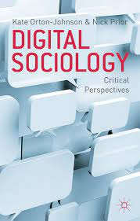

layout: true

```{r setup, include=FALSE}
options(htmltools.dir.version = FALSE)

knitr::opts_chunk$set(
	echo = FALSE,
	fig.align = "center",
	message = FALSE,
	warning = FALSE,
	cache = FALSE
)
```

```{r eval=FALSE, include=FALSE}
library(knitr)
library(tidyverse)
```

---
class: middle, center  

# Apresentações!😃 🙋️

---
class: middle, center  

# Leonardo F. Nascimento

```{r out.width="25%"}
knitr::include_graphics("img/logos_bia.png")
```

## 15% Programador, 20% Químico, 25% Psicólogo, 40% Cientista Social
<br>

### [Email: **leofn3@gmail.com**](mailto:leofn3@gmail.com) 

### [Twitter:**@leofn3**](http://www.twitter.com/leofn3) 

### [website: **www.leofn.com**](http://www.leofn.com)

---
class: middle, center  

```{r, out.width="50%"}
knitr::include_graphics("img/labhd.png")
```

## Laboratório de Humanidades Digitais da UFBA

**Twitter**: [@labhdufba](https://twitter.com/labhdufba) 
<br>
**Instagram**: [@labhdufba](http://instagram.com/labhdufba)
<br>
**Github**: [https://github.com/LABHDUFBA](https://github.com/LABHDUFBA)
<br>
**Youtube**: [https://www.youtube.com/c/LABHDUFBA](https://www.youtube.com/c/LABHDUFBA)

---
class: middle, center

# Pesquisa atual
--

```{r, out.width="100%"}
knitr::include_graphics("img/telegram-2.png")
```

### + info [clique](https://internetlab.org.br/pt/noticias/analisando-os-ecossistemas-de-desinformacao-politica-no-telegram-durante-o-periodo-eleitoral/) 

---
class: middle, center

# Financiamento

.pull-left[
```{r, out.width="80%"}
knitr::include_graphics("img/cnpq.jpg")
```
]
.pull-right[
```{r, out.width="90%"}
knitr::include_graphics("img/internetlab.png")
```
]

---
class: inverse, center, middle

# Objetivo do encontro

---
class: inverse, center, middle

# Apresentar um breve panorama da Ciência Social Computacional (CSC) e sua relação com a Sociologia/Antropologia/História/Humanidades Digitais, enfatizando conceitos, ferramentas e desafios!

---
class: center, middle

# Duplo diagnóstico:
<br>

--
## 1) "Digitalização do eu na vida cotidiana";
<br>

--
## 2) Efeitos da "digitalização" sobre a produção de conhecimento nas Humanidades.

---
class: inverse, middle, center

# 1) "Digitalização do eu na vida cotidiana" 

```{r, out.width="80%"}
knitr::include_graphics("img/ds.jpeg")
```
---
class: middle, center

# Algoritmização de processos sociais

```{r, out.width="60%"}
knitr::include_graphics("img/matrix-digital-self.png")
```

---
class: middle, center

# Traços digitais (digital data trace)

```{r, out.width="75%"}
knitr::include_graphics("img/socioloy.png")
```

---
class: middle, center

# Dataficação

```{r, out.width="75%"}
knitr::include_graphics("img/datafication4.jpg")
```

---
class: middle, center

# Cultura de vigilância

```{r, out.width="65%"}
knitr::include_graphics("img/surv.jpg")
```

---
class: inverse, middle, center

# 2) Efeitos da "digitalização" sobre a produção de conhecimento nas Humanidades.


---
class: middle, center

.pull-left[

# 2000

```{r, out.width="110%"}
knitr::include_graphics("img/abbott.png")
```
[Clique para acessar](https://doi.org/10.2307/2654383)
]
.pull-right[
# 2007

```{r, out.width="110%"}
knitr::include_graphics("img/savage.png")
```
[Clique para acessar](https://journals.sagepub.com/doi/10.1177/0038038507080443)
]

---
class: middle, center

# [Reflections on the Future of Sociology - 2000](https://doi.org/10.2307/2654383)

--
### "mais comportamentos conduzidos eletronicamente" -> "dados em tempo contínuo e em nível populacional" 
<br>

-- 
### "... sociologia está lamentavelmente despreparada para lidar com esse problema: não temos nem as ferramentas analíticas nem a imaginação conceitual necessária"
<br>

--
### "temos hoje demasiados teóricos que não fazem nada além de pensar sobre a teoria anteriormente produzida. [...] Importantes teorias sociais sempre crescem a partir de um extenso trabalho empírico"
<br>

---
class: inverse, middle, center

# "A Sociologia precisa de uma nova e grande idéia teórica" (ABBOTT, 2000, p. 299)

---
class: middle, center

# [The Coming Crisis of Empirical Sociology - 2007](https://journals.sagepub.com/doi/abs/10.1177/0038038507080443)
<br>

--
### Um dos artigo mais citados da sociologia (1411 citações em 2023!) 
<br>

--
### Aborda as mudanças no significado da pesquisa empírica e nos repertórios metodológicos da sociologia
<br>

--
### Ideia central: "É a relevância das tecnologias de pesquisa empírica para a sociedade que torna a sociologia um campo de pesquisas importante socialmente"


---
class: middle, center

.pull-left[
#2009

```{r, out.width="100%"}
knitr::include_graphics("img/wynn.png")
```
[Clique para acessar](https://doi.org/10.1111/j.1573-7861.2009.01109.x)

]
.pull-right[

#2013

```{r, out.width="80%"}

```
[Clique para acessar](https://www.amazon.com.br/Digital-Sociology-Perspectives-Kate-Orton-Johnson/dp/0230222838)
]

---
class: inverse, middle, center

# "nós deveríamos treinar os estudantes para serem reflexivos em relação à tecnologia" (WYNN, 2009, p. 449)

---
class: middle, center

.pull-left[

#2015

```{r, out.width="100%"}
knitr::include_graphics("img/lupton.jpg")
```
[Clique para acessar](https://www.amazon.com.br/Digital-Sociology-Deborah-Lupton/dp/1138022772/ref=sr_1_1)

]
.pull-right[

#2017

```{r, out.width="100%"}
knitr::include_graphics("img/marres.jpg")
```
[Clique para acessar](https://www.amazon.com.br/Digital-Sociology-Reinvention-Research-English-ebook/dp/B071HRPK4B/ref=sr_1_2)
]

---
class: middle, center

.pull-left[

#2019

```{r, out.width="65%"}
knitr::include_graphics("img/selwyn.jpg")
```
[Clique para acessar](https://www.amazon.com.br/What-Digital-Sociology-Neil-Selwyn/dp/1509527117)

]
.pull-right[

#2020*

```{r, out.width="950px"}
knitr::include_graphics("img/gabe.jpeg")
```
[Clique para acessar](https://www.amazon.com/Sociological-Theory-Digital-Gabe-Ignatow/dp/0367263475)
]

---
class: middle, center

.pull-left[

#2016

```{r, out.width="100%"}
knitr::include_graphics("img/leo.png")
```
[Clique para baixar](https://www.scielo.br/j/soc/a/y9gtcQSrjjXVyRfryrKpXBk/?format=pdf&lang=pt
)
]

.pull-right[

#2021

```{r, out.width="80%"}
knitr::include_graphics("img/bookleo.png")
```
[Clique para baixar](https://repositorio.ufba.br/ri/handle/ri/32746/statistics)]

---

class: inverse, center, middle

# Como eu cheguei na **sociologia digital**? (ou era uma vez um **N00b**...)

```{r, out.width="60%"}
knitr::include_graphics("https://media.giphy.com/media/9rtpurjbqiqZXbBBet/giphy.gif")
```

---
class: inverse, center, middle

# Desafios

### Novos tipos/padrões/estruras de dados sobre o comportamento em sociedade - movimento auto-reflexivo: "sociologia dos datasets"

### Aprendizando de novas medotodologias  - movimento auto-reflexivo: "sociologia das ferramentas digitais"


### articulação da teoria social com novas metodologias

- Estudantes de graduação e pós-graduação seriam ensinados
como construir uma teoria por conta própria, principalmente fazendo pequenos projetos empíricos que introduzem os alunos à abstração, abdução e indução.

- Ensinar teorização como uma habilidade prática em vez de teoria como história intelectual implica em desenvolver habilidades em design de pesquisa, resolução de problemas e pensamento abstrato, analógico e abdutivo.


---
class: inverse, center, middle

# Conceitos


---
class: inverse, center, middle

# O que significa o **digital** na **sociologia digital**?

---
class: middle, center

--
## 1. Digital como **objeto de pesquisa**;
<br>

--
## 2. Digital como **instrumentos e métodos de pesquisa**;
<br>

--
## 3. Digital como **plataforma** para nos engajarmos com audiências e públicos mais amplos.

---
class: inverse, center, middle

# Três conjuntos de **desafios**?

---
class: middle, center

# **Dados digitais**
<br>

--
## Publicidade e acessibilidade
<br>

--
## Terceirização da etapa de coleta de dados
<br>

--
## Evoca versus coleta (*repurpose* - Salganik, 2020)
<br>

--
## Representatividade dos dados
<br>

--
## big data (Cf. Salganik, 2020)
<br>

---
class: middle, center

# **Métodos digitais**
<br>

--
## Letramento digital
<br>

--
## Articulação analógico e digital
<br>

--
## Superação da suposta oposição Quali-quanti
<br>

--
## Crítica e epistemológica às ferramentas digitais
<br>

---
class: middle, center

# **Plataformas**
<br>

--
## Presença digital: visibilidade e engajamento
<br>

--
## Tentação ao profetismo
<br>

--
## Sedução das lógicas de metrificação das plataformas
<br>

---
class: inverse, center, middle

# Para finalizar: como eu aprendo a fazer **sociologia digital**?

---
class: middle, center

--
# Vamos aprender a andar de bicicleta?
<br>

--
### Utilidade;
<br>

--
### Aprendizado; 
<br>

--
### Aperfeiçoamento;
<br>

--
### Diversificação;
<br>

--
### "Artesanato digital"
<br>

---
class: inverse, center, middle

# **Na prática** o que eu devo fazer?


---
class: middle, center

# Conclusões

## "The internet is configuring a new scholarly apparatus that engenders different modes of research, scholarship and communication" (Featherstone, 2009)


---
class: middle, center

## Obrigado gente!

.pull-left[
```{r, out.width="70%"}
knitr::include_graphics("https://media.giphy.com/media/JQRVMKkWAQbdiXFBkg/giphy.gif")
```
]
.pull-right[
##**Agradecimentos especiais**: 

- À Polyana Barboza, Lucas Roberto Silva, Amaro Grassi, Tiago Ventura pelo convite!

- Aos **bolsistas IC do projeto (Pibic, Pibiti e Permanecer):** Iolanda, Thamyres, Daniel, Talia, Emily, Beatriz, Priscila, Ingrid, Anna Carol, Malu, Juciane (mestranda) e Jefte (mestrando)!
<br>

### 
<br>

### Vida longa ao SICSS!
]


---
class: middle, center

## Referências bilbiográficas

#### [FEATHERSTONE, M. Ubiquitous Media: An Introduction. Theory, Culture & Society, v. 26, n. 2–3, p. 1–22, 1 mar. 2009.](https://journals.sagepub.com/doi/10.1177/0263276409103104)
