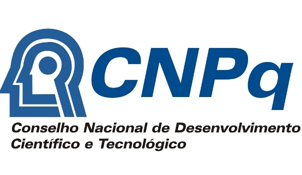
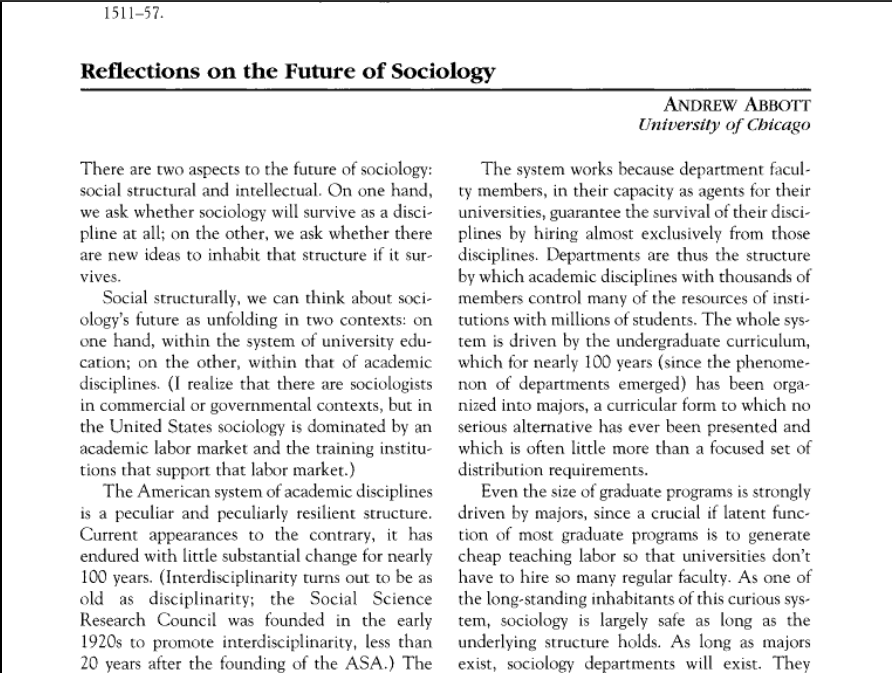
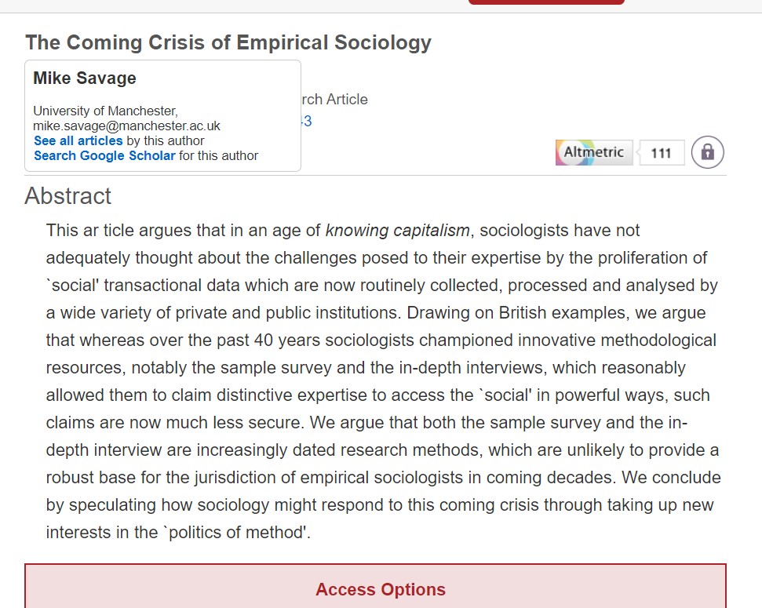
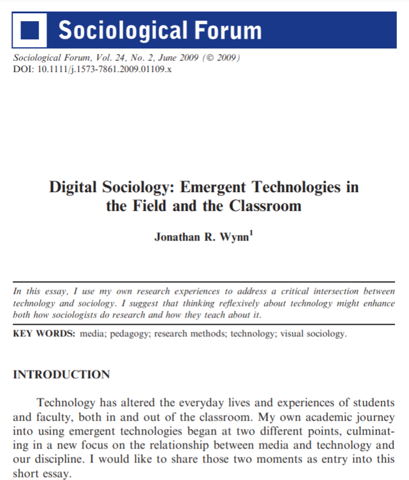
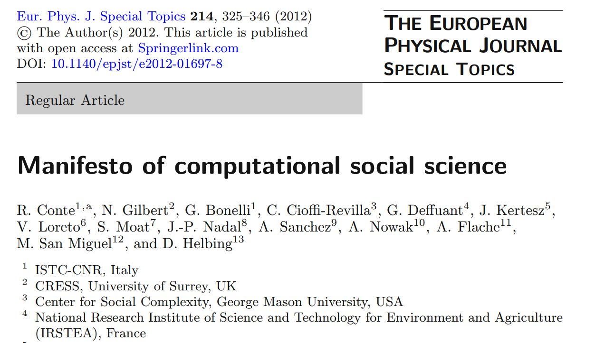
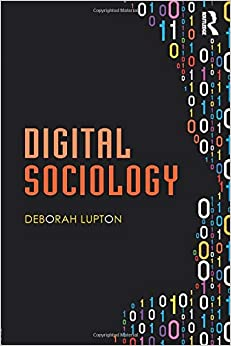
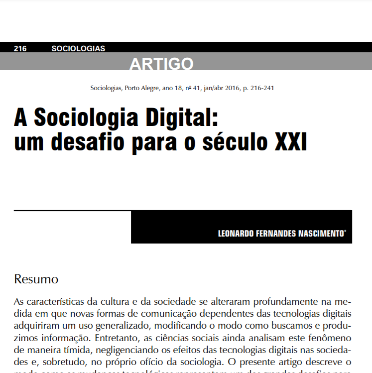
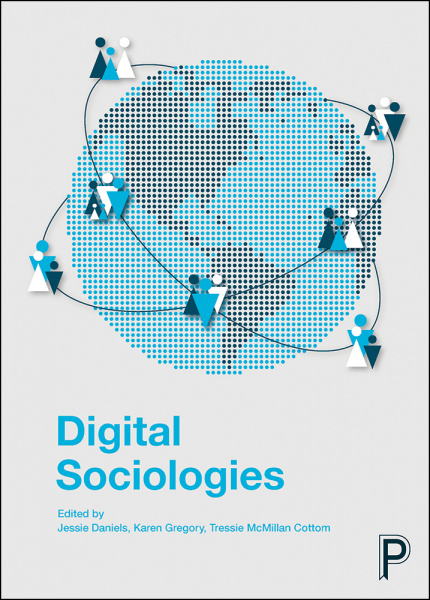
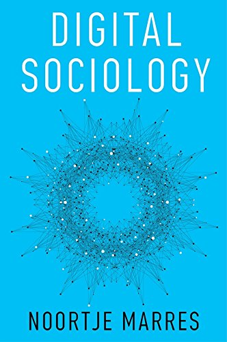
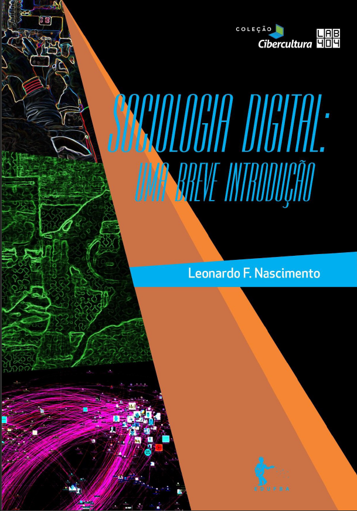

layout: true

```{r setup, include=FALSE}
options(htmltools.dir.version = FALSE)

knitr::opts_chunk$set(
	echo = FALSE,
	fig.align = "center",
	message = FALSE,
	warning = FALSE,
	cache = FALSE
)
```

```{r eval=FALSE, include=FALSE}
library(knitr)
library(tidyverse)
```

---
class: middle, center  

# Apresentações!😃 🙋️

---
class: middle, center  

# Leonardo F. Nascimento

```{r out.width="25%"}
knitr::include_graphics("img/logos_bia.png")
```

## 15% Programador, 20% Químico, 25% Psicólogo, 40% Cientista Social
<br>

### [Email: **leofn3@gmail.com**](mailto:leofn3@gmail.com) 

### [Twitter:**@leofn3**](http://www.twitter.com/leofn3) 

### [website: **www.leofn.com**](http://www.leofn.com)

---
class: middle, center  

```{r, out.width="50%"}

```

## Laboratório de Humanidades Digitais da UFBA

**Twitter**: [@labhdufba](https://twitter.com/labhdufba) 
<br>
**Instagram**: [@labhdufba](http://instagram.com/labhdufba)
<br>
**Github**: [https://github.com/LABHDUFBA](https://github.com/LABHDUFBA)
<br>
**Youtube**: [https://www.youtube.com/c/LABHDUFBA](https://www.youtube.com/c/LABHDUFBA)

---
class: middle, center

# Pesquisa atual
--

```{r, out.width="100%"}
knitr::include_graphics("img/telegram-2.png")
```

### + info [clique](https://internetlab.org.br/pt/noticias/analisando-os-ecossistemas-de-desinformacao-politica-no-telegram-durante-o-periodo-eleitoral/) 

---
class: middle, center

# Financiamento

.pull-left[
```{r, out.width="80%"}

```
]
.pull-right[
```{r, out.width="90%"}

```
]

---
class: inverse, center, middle

# Objetivo do encontro

---
class: center, middle

# Apresentar um panorama da Ciência Social Computacional (CSC) e sua relação com a Sociologia/Antropologia/História/Humanidades Digitais, enfatizando conceitos, ferramentas e desafios!

---
class: inverse, middle, center

# Desafios

```{r, out.width="80%"}
knitr::include_graphics("https://media.giphy.com/media/MJgPOGVdwyOaxu0R3L/giphy.gif")
```

---
class: center, middle

# De onde vem os atuais desafios? 
<br>

--
## 1) "Digitalização do eu na vida cotidiana" (Nascimento, 2020);
<br>

--
## 2) Efeitos da "digitalização" sobre a produção de conhecimento nas Humanidades.

---
class: inverse, middle, center

## 1) "Digitalização do eu na vida cotidiana" (Nascimento, 2020)

```{r, out.width="80%"}
knitr::include_graphics("img/ds.jpeg")
```
---
class: inverse, center, middle

## Algoritmização de processos sociais

```{r, out.width="60%"}
knitr::include_graphics("img/matrix-digital-self.png")
```

---
class: inverse, center, middle

## Traços digitais (Howison et al. 2011, p. 769)


```{r, out.width="75%"}
knitr::include_graphics("img/socioloy.png")
```

---
class: inverse, center, middle

## Dataficação (Cukier & Mayer-Schoenberger, 2013)

```{r, out.width="75%"}
knitr::include_graphics("img/datafication4.jpg")
```

---
class: inverse, center, middle

## Cultura de vigilância (Lyon, 2018)


```{r, out.width="65%"}
knitr::include_graphics("img/surv.jpg")
```

---
class: inverse, middle, center

# 2) Efeitos da "digitalização" sobre a produção de conhecimento nas Humanidades.

---
class: middle, center

.pull-left[

## ABBOTT, 2000

```{r, out.width="110%"}

```
[Clique para acessar](https://doi.org/10.2307/2654383)
]
.pull-right[
## Savage & Burrows, 2007

```{r, out.width="110%"}

```
[Clique para acessar](https://journals.sagepub.com/doi/10.1177/0038038507080443)
]

---
class: middle, center

# [Reflections on the Future of Sociology - 2000](https://doi.org/10.2307/2654383)
<br>

--
### "+ comportamentos conduzidos eletronicamente" e "+ dados em tempo contínuo e em nível populacional" 
<br>

--
### **"...sociologia está lamentavelmente despreparada para lidar com esse problema: não temos nem as ferramentas analíticas nem a imaginação conceitual necessária"**
<br>

--
### "temos demasiados teóricos que não fazem nada além de pensar sobre a teoria anteriormente produzida. [...] Importantes teorias sociais sempre crescem a partir de um extenso trabalho empírico"
<br>

---
class: inverse, middle, center

# "A Sociologia precisa de uma nova e grande idéia teórica" (ABBOTT, 2000, p. 299)

---
class: middle, center

# [The Coming Crisis of Empirical Sociology - 2007](https://journals.sagepub.com/doi/abs/10.1177/0038038507080443)
<br>

--
### Um dos artigo mais citados da sociologia (1411 citações em 2023!) 
<br>

--
### Aborda as mudanças no significado da pesquisa empírica e nos repertórios metodológicos da sociologia
<br>

--
### Ideia central: "É a relevância das tecnologias de pesquisa empírica para a sociedade que torna a sociologia um campo de pesquisas importante socialmente"


---
class: middle, center

.pull-left[
## Wynn, 2009

```{r, out.width="100%"}

```
[Clique para acessar](https://doi.org/10.1111/j.1573-7861.2009.01109.x)

]
.pull-right[

## Conte, Gilbert, Bonelli et al, 2012
 
```{r, out.width="110%"}

```
[Clique para acessar](https://link.springer.com/article/10.1140/epjst/e2012-01697-8)
]

---
class: inverse, middle, center

# "A crescente integração da tecnologia em nossas vidas criou volumes sem precedentes de dados que a abrem novas oportunidades em direção a um entendimento quantitativo dos sistemas sociais" (Conte, Gilbert, Bonelli et al, 2012)

---
class: middle, center

.pull-left[

## HORST & MILLER, 2012

```{r, out.width="100%"}

```
[Clique para acessar](https://www.amazon.ca/Digital-Anthropology-Heather-Horst/dp/0857852906)

]
.pull-right[

## JUNGHERR, 2015

```{r, out.width="100%"}

```
[Clique para acessar](https://link.springer.com/book/10.1007/978-3-319-20319-5)
]

---
class: inverse, middle, center

# "a própria idéia de 'cultura' ou 'sociedade' não pode ser plenamente compreendida sem o reconhecimento de que os dispositivos de software e hardware constituem ativamente a individualidade, a corporeidade, a vida social, as relações sociais e as instituições" (HORST & MILLER, 2012)

---
class: inverse, middle, center

# Apesar de todas as diferenças, ciências sociais computacionais, métodos digitais e big data compartilham uma convicção subjacente: novas fontes de dados e novas técnicas para armazenamento e análise de dados podem levar à próxima mudança de paradigma nas ciências sociais. (JUNGHERR, 2015, p.34)

---
class: middle, center

.pull-left[

## Lupton, 2015

```{r, out.width="100%"}

```
[Clique para acessar](https://www.amazon.com.br/Digital-Sociology-Deborah-Lupton/dp/1138022772/ref=sr_1_1)

]
.pull-right[

## Nascimento, 2016

```{r, out.width="100%"}

```
[Clique para baixar](https://www.scielo.br/j/soc/a/y9gtcQSrjjXVyRfryrKpXBk/?format=pdf&lang=pt)
]

---
class: inverse, middle, center

# Eu argumentaria que a sociologia precisa fazer o estudo das tecnologias digitais central às suas atribuições. Todos os tópicos que os sociólogos agora pesquisam e ensinam estão inevitavelmente conectados às tecnologias digitais (LUPTON, 2015, p. 5)


---
class: inverse, middle, center

# Quando algum sociólogo supera a barreira epistemológica do qualitativismo tacanho que impera nos programas de pós-graduação, ele se encontra desesperado porque simplesmente precisa “terceirizar” a coleta e análise dos dados. (Nascimento, 2016, p.234)

---
class: middle, center

.pull-left[

## Rockwell & Sinclair, 2016

```{r, out.width="100%"}
knitr::include_graphics("img/rock.avif")
```
[Clique para acessar](https://mitpress.mit.edu/9780262545891/hermeneutica/)

]

.pull-right[

## DANIELS, GREGORY, & COTTOM, 2016. 


```{r, out.width="100%"}

```
[Clique para acessar](https://www.amazon.ca/Digital-Sociologies-Jessie-Daniels/dp/1447329015)

] 

---
class: middle, center

.pull-left[

## Marres, 2017

```{r, out.width="100%"}

```
[Clique para acessar](https://www.amazon.com.br/Digital-Sociology-Reinvention-Research-English-ebook/dp/B071HRPK4B/ref=sr_1_2)

]
.pull-right[

## 2019

```{r, out.width="100%"}

```
[Clique para acessar](https://www.amazon.com.br/What-Digital-Sociology-Neil-Selwyn/dp/1509527117)

]

---
class: inverse, middle, center

# Digital como "fato social total" (Marres, 2017)

---
class: middle, center

.pull-left[

## Ignatow, 2020

```{r, out.width="120%"}
knitr::include_graphics("img/gabe.jpeg")
```
[Clique para acessar](https://www.amazon.com/Sociological-Theory-Digital-Gabe-Ignatow/dp/0367263475)
]
.pull-right[

## Nascimento, 2021

```{r, out.width="70%"}

```
[Clique para baixar](https://repositorio.ufba.br/ri/handle/ri/32746/statistics)]

]

---
class: inverse, center, middle

# Desafios

---
class: center, middle

# Produzir uma Ciência Social Computacional crítica...
<br>

--
## ...dos datasets"
<br>

--
## ...das ferramentas
<br>

--
## ...que articule teoria social e métodos computacionais
<br>

--
## ...e pública
<br>

---
class: center, middle

# CSC: crítica dos datasets
<br>
<br>

--
## ["Raw Data" Is an Oxymoron](https://direct.mit.edu/books/book/3992/Raw-Data-Is-an-Oxymoron) 

---
class: center, middle

# CSC: crítica dos datasets
<br>

--
## "Para trabalhar com dados, você precisa entender aquilo que os dados estão tentando representar. Uma das primeiras coisas que devemos fazer diante de uma base de dados, é compreender as condições através das quais essa base de dados chegou a existir. Há sempre uma história por trás dos dados. Há sempre uma narrativa."

[Smari McCarthy, making data speak](https://exposingtheinvisible.org/en/films/smari-mccarthy-making-data-speak/)


---
class: center, middle

# CSC: crítica dos datasets
<br>

--
## O trabalho do <s>historiador</s> ciêntista social diante do arquivo digital, portanto, não é tão diferente do trabalho diante do arquivo físico, pois exige tanto rigor metodológico no tratamento da fonte quanto o tratamento de uma fonte não digital. [...]esse cuidado muitas vezes é escamoteado diante da profusão de fontes, a agilidade da busca, a velocidade do acesso e a facilidade do armazenamento. 
<br>

## [Brasil & Nascimento, 2020](https://www.scielo.br/j/eh/a/XNJJWhFFzPKdkhF6cyj5BJv/)

---
class: center, middle

# CSC: crítica dos datasets
<br>

--
## Publicidade, acessibilidade e terceirização
<br>

--
## Evocaçao/"Ad hoc" versus coleta (*repurpose* - Salganik, 2020)
<br>

---
class: center, middle

# CSC: crítica das ferramentas
<br>

--
## Um "erro no código" passa a constituir um "erro metodológico"

```{r, out.width="100%"}
knitr::include_graphics("img/python.png")
```

---
class: middle, center

# CSC: crítica das ferramentas
<br>

--
## "nossos ajudantes digitais já estão cheios de teoria e julgamento" (Bernhard Rieder and Theo Röhle in: BERRY, 2012, p. 70)

```{r, out.width="40%"}
knitr::include_graphics("img/bender.jpg")
```

---
class: middle, center

# CSC: crítica das ferramentas
<br>

--
## “Não existe neutralidade metodológica das técnicas” 
(BOURDIEU; PASSERON; CHAMBOREDON, 2004, p. 55)

```{r, out.width="40%"}

```

---
class: middle, center

# CSC: crítica das ferramentas
<br>

--
## Letramento digital
<br>

--
## Articulação analógico e digital
<br>

--
## Superação da suposta oposição Quali-quanti
<br>

---
class: center, middle

# CSC: articulação teoria e empiria
<br>

--
### Estudantes de graduação e pós-graduação [deveriam ser] ensinados como construir uma teoria por conta própria, principalmente fazendo pequenos projetos empíricos que introduzem os alunos à abstração, abdução e indução. Ensinar teorização como uma habilidade prática em vez de teoria como história intelectual implica em desenvolver habilidades em design de pesquisa, resolução de problemas e pensamento abstrato, analógico e abdutivo. 
<br>

##(Ignatow, 2020, p.96)

---

---
class: middle, center

# CSC crítica e pública
<br>

--
## Importância da presença digital: visibilidade e engajamento
<br>

--
## Data power!
<br>

--
## Tentação ao profetismo e sedução pelas lógicas de metrificação 
<br>

---
class: inverse, center, middle

# Como eu aprendo a fazer **Ciência Social Computacional**?

---
class: middle, center

--
# Vamos aprender a andar de bicicleta?
<br>

--
### Utilidade;
<br>

--
### Aprendizado; 
<br>

--
### Aperfeiçoamento;
<br>

--
### Diversificação;
<br>

--
### "Artesanato digital"
<br>

---
class: middle, center

# À guisa de conclusão: "certo, mas onde eu começo"?
<br>

--
## Investir no letramento digital!
<br>

--
## Praticar ciência aberta: dados abertos, códigos abertos, ferramentas abertas;
<br>

--
## Abandonar o fetichismos dos dados, dos métodos e dos resultados

---
class: inverse, middle, center


# FIM DO PRIMEIRO ENCONTRO!
<br>

---
class: center, middle

# Dúvidas, perguntas?

---
class: inverse, middle, center

# Ferramentas

```{r, out.width="70%"}
knitr::include_graphics("https://media.giphy.com/media/3oFzmhSdxPiyRyR5vi/giphy.gif")
```

---
class: center, middle

# Gerenciamento de referências bibliográficas

```{r, out.width="75%"}

```

---
class: center, middle

# Gerenciamento de referências bibliográficas
<br>

--
### Por que? Para que? 
<br>

--
### [https://www.zotero.org/](https://www.zotero.org/)
<br>

--
### [Zotero do Zero - Tutorial de instalação do Zotero no Windows 10](https://youtu.be/CPdhyKboKC0)
<br>

--
### [Workshop de Zotero - Ferramentas Digitais e a pesquisa em Humanidades](https://youtu.be/I5ohkh5d51Y)

---
class: center, middle

# Análise qualitativa de dados
<br>

--
## Por que? Para que? 
<br>

--
### [ATLAS.ti](https://atlasti.com/)

--
### [NVivo](https://www.qsrinternational.com/nvivo-qualitative-data-analysis-software/home)

--
### [MaxQDA](https://www.maxqda.com/)

--
### [Iramuteq](http://www.iramuteq.org/)

--
### [RQDA](https://rqda.r-forge.r-project.org/)

---
class: center, middle

# Análise qualitativa de dados (ATLAS.ti)
<br>

--
## [Slides para aprender o ATLAS.ti versão 7](https://prezi.com/c851ggslq3ef/atlasti-ufjf-2017-modulo-i/?present=1)
<br>

--
## [Oficina LABHDUFBA - ATLAS.ti 7 (parte 1)](https://youtu.be/wmYHvfxfM5Q)
<br>

--
## [Oficina LABHDUFBA - ATLAS.ti 7 (parte 2)](https://youtu.be/IB3ldXF1zEM)

---
class: center, middle

# R/Rstudio
<br>

--
## Por que? Para que? 
<br>

--
### [Como instalar?](https://livro.curso-r.com/1-1-instalacao-do-r.html)
<br>

--
### [Comece aqui!](https://maryms.github.io/2019-02-R-Basics-R-LadiesSP/#1)
<br>

--
### [Onde aprender mais?](https://github.com/beatrizmilz/materiais_estudo_R)
<br>

--
### [Canal do R-Brasil no Telegram!](https://t.me/rbrasiloficial)
<br>

---
class: center, middle

# R/Rstudio (plus ultra)
<br>

### [Canal do R e RStudio 📈📊Humanidades no Telegram!](https://t.me/R_humanidades)
<br>

--
### [SICSS R/Rstudio](https://sicss.io/boot_camp/)
<br>

--
### [R for Data Science](https://r4ds.had.co.nz/index.html)
<br>

--
### [Introduction to R for Social Scientists](https://clanfear.github.io/CSSS508/)
<br>

--
### [Curso de R](https://livro.curso-r.com/2-rstudio.html)

---
class: center, middle

# Python
<br>

--
## Por que? Para que? 
<br>

--
### [Como instalar?](http://python.org.br/instalacao-windows/)
<br>

--
### [Comece aqui!](https://leofn.github.io/oficina-python/#/)
<br>

--
### [Onde aprender mais?](https://pythonhumanities.com/python-for-dh-course/)


---
class: center, middle

# Git
<br>

--
## Por que? Para que? 
<br>

--
## [Como instalar?](https://www.youtube.com/watch?v=IJ2VDiDLzj8)
<br>

--
## [Comece aqui!](https://github.com/rladies/meetup-presentations_sao-paulo/blob/master/pdf_presentations/2019-09-12-RLadies-12-Git-Github-Ana-Bastos.pdf)
<br>

---
class: center, middle

# GitHub
<br>

--
## Por que? Para que? 
<br>

--
## [Git e Github para noobs das humanidades](https://www.youtube.com/watch?v=ZSevDOHWsNM)
<br>

--
##[Git e Github no RStudio](https://beatrizmilz.github.io/RLadies-Git-RStudio-2019/#1)

---
class: center, middle

# Análise de redes: Gephi
<br>

--
## Por que? Para que? 
<br>

--
## [Como instalar?](https://ibpad.com.br/comunicacao/aprenda-a-instalar-o-gephi/)
<br>

--
## [Comece aqui!](https://seinecle.github.io/gephi-tutorials/generated-pdf/simple-project-from-a-to-z-en.pdf)
<br>

--
## [Preparando seus dados: Table 2 Net](https://medialab.github.io/table2net/)

---
class: center, middle

# Ferramentas de raspagem para Instagram
<br>

--
class: center, middle

## [Instaloader](https://instaloader.github.io/)
<br>

--
## Após instalar o Python 3 (e devidamente colocado no PATH do Windows!
<br>

--
## pip ou pip3 install instaloader
<br>

--
## DIGITE após "C:\diretorio>" .---> instaloader profile perfil_sem_@

---
class: center, middle

# Ferramentas de raspagem para Twitter
<br>

## [rtweet](https://docs.ropensci.org/rtweet/)

---
class: center, middle

# Ferramentas para análise de texto: Voyant Tools
<br>

--
## Por que? Para que? 
<br>

--
## [Como instalar?](https://voyant-tools.org/)
<br>

--
## [Comece aqui!](http://www.larhud.ibict.br/index.php?title=Voyant_Tools)
<br>

---
class: center, middle

# Digital Methods Intiative
<br>

--
## Por que? Para que?  
<br>

--
## [Digital Methods Intiative](Digital Methods Initiative)
<br>

--
## [Lista de ferramentas](https://wiki.digitalmethods.net/Dmi/ToolDatabase)
<br>

---
class: center, middle

# Programming Historian
<br>

--
## Por que? Para que? 
<br>

--
## [Site do Programming Historian](https://programminghistorian.org/pt/)

---
class: center, middle

# SICSS - SSummer Institute in Computational Social Science
<br>

--
## Por que? Para que? 
<br>

--
## [SICSS - SSummer Institute in Computational Social Science](https://sicss.io/curriculum)
<br>


---
class: inverse, center, middle

# Alguns conceitos básicos


---
class: inverse, center, middle

# Webscraping

---
class: center, middle

--
## Em português, "raspagem de dados";
<br>

--
## Envolve acessar, baixar e organizar de maneira sistemática dados provenientes da web; 
<br>

--
## Tudo o que você vê na internet pode se transformar dados para analisar!
<br>

--
## Por que aprender?

---
class: inverse, center, middle

```{r, out.width="80%"}
knitr::include_graphics("https://media.giphy.com/media/IZY2SE2JmPgFG/giphy.gif")
```
### "Nunca mande um humano fazer o trabalho de um robô!"

---
class: inverse, center, middle

# API

---
class: center, middle

--
## Application Programming Interface;
<br>

--
## Forma unificada para acessar dados de uma plataforma, a partir de qualquer linguagem de programação;
<br>

--
## Facilita a vida da pessoa que programa;
<br>

--
## Geralmente vem acompanhada de documentação.
<br>

--
## Reduz o volume na transferência de dados

---
class: middle, center

# Final do segundo encontro! Dúvidas? Perguntas?

---
class: middle, center

# Obrigado gente!

.pull-left[
```{r, out.width="150%"}
knitr::include_graphics("https://media.giphy.com/media/3oz8xIsloV7zOmt81G/giphy.gif")
```
]
.pull-right[
#### **Agradecimentos especiais**: 

- Professor Tiago Ribeiro Duarte e ao Programa de Pós-Graduação em Sociologia UnB pelo convite!

]

---
class: middle, center

## Referências bilbiográficas

BOURDIEU, P.; PASSERON, J. C.; CHAMBOREDON, J. C. Ofício de Sociólogo: metodologia da pesquisa na sociologia. Petrópolis: Vozes, 2004. 

Boyd, D., & Crawford, K. (2012). Critical questions for big data. Information, Communication & Society, 15(5), 662–679

[FEATHERSTONE, M. Ubiquitous Media: An Introduction. Theory, Culture & Society, v. 26, n. 2–3, p. 1–22, 1 mar. 2009.](https://journals.sagepub.com/doi/10.1177/0263276409103104)

[HOWISON, J.; WIGGINS, A.; CROWSTON, K. Validity Issues in the Use of Social Network Analysis with Digital Trace Data. Journal of the Association for Information Systems, v. 12, n. 12, 29 dez. 2011.](http://aisel.aisnet.org/jais/vol12/iss12/2)

RIEDER, B.; RÖHLE, T. Digital Methods. In: SCHÄFER, M. T.; VAN ES, K. (Ed.). The Datafied Society. Studying Culture through Data. [s.l.] Amsterdam University Press, 2017. p. 109–124. 

[SOUTHERTON, C. Datafication. In: SCHINTLER, L. A.; MCNEELY, C. L. (Ed.). Encyclopedia of Big Data. Cham: Springer International Publishing, 2020. p. 1–4.](https://link.springer.com/referenceworkentry/10.1007%2F978-3-319-32001-4_332-1)


