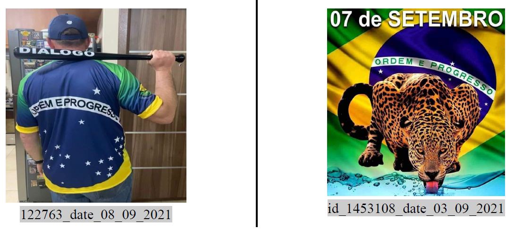

layout: true

```{r setup, include=FALSE}
options(htmltools.dir.version = FALSE)

knitr::opts_chunk$set(
	echo = FALSE,
	fig.align = "center",
	message = FALSE,
	warning = FALSE,
	cache = FALSE
)
```

```{r eval=FALSE, include=FALSE}
library(knitr)
library(tidyverse)
library(widgetframe)
```
---
class: middle, center  

# Leonardo F. Nascimento

```{r out.width="25%"}
knitr::include_graphics("img/logos_bia.png")
```

## 15% Programador, 20% Químico, 25% Psicólogo, 40% Cientista Social
<br>

### [Email: **leofn3@gmail.com**](mailto:leofn3@gmail.com) 

### [Twitter:**@leofn3**](http://www.twitter.com/leofn3) 

### [website: **www.leofn.com**](http://www.leofn.com)

---
class: middle, center  

```{r, out.width="50%"}
knitr::include_graphics("img/labhd.png")
```

## Laboratório de Humanidades Digitais da UFBA

**Twitter**: [@labhdufba](https://twitter.com/labhdufba) 
<br>
**Instagram**: [@labhdufba](http://instagram.com/labhdufba)
<br>
**Github**: [https://github.com/LABHDUFBA](https://github.com/LABHDUFBA)
<br>
**Youtube**: [https://www.youtube.com/c/LABHDUFBA](https://www.youtube.com/c/LABHDUFBA)

---
class: middle, center

# Financiamento

.pull-left[
```{r, out.width="80%"}
knitr::include_graphics("img/cnpq.jpg")
```
]
.pull-right[
```{r, out.width="90%"}
knitr::include_graphics("img/internetlab.png")
```
]

---
class: inverse, center, middle

# Pesquisa sobre desinformação no Telegram
--

<br>
## Como começou?
--

<br>
## O que estamos fazendo!
--

<br>
## Onde queremos chegar...

---
class: inverse, middle, center

## Graus ou níveis computacionais da pesquisa em ciências sociais!

```{r, out.width="80%"}
knitr::include_graphics("img/evolution.gif")
```

---
class: inverse, center, middle

# Como começou?

---
class: middle, center

<br>
## Março de 2020: pandemia, início de controvérsias
--

<br>
## Telegram: híbridismo e paradoxo;   
--

<br>
## Controvérsias científicas e extrema-direita 

---
class: inverse, middle, center

# Procedimentos computacionais

---
class: middle, center

## Exportação do Telegram (HTML), processamento no R, GitHub

```{r, out.width="150%"}

```

---
class: middle, center

# dataset

## jan-dez/2020
## 3 variables
## +500k msgs
## 1 group (+12k users)

```{r, out.width="95%"}

```

---
class: middle, center

## Quali: ATLAS.ti + Grounded Theory

```{r, out.width="150%"}

```

---
class: inverse, middle, center

# Enquadramento teórico

---
class: middle, center

<br>
## 1. Poder oracular/estudos sobre ignorância (McGoey 2019);
--

<br>
## 2. Populismo digital no Brasil (Cesarino, 2020)


---
class: inverse, center, middle

# O que esse nível computacional exigiu do pesquisador e o que ele permitiu enxergar/compreender sobre os dados?

---
class: middle, center

# msgs txt x msg media

```{r, out.width="150%"}
knitr::include_graphics("img/g1_08-04-2021.png")
```

---
class: middle, center

# "Talkatives"

```{r, out.width="150%"}
knitr::include_graphics("img/g2_08-04-2021.png")
```

---
class: middle, center

# Frequência de temáticas 

```{r, out.width="150%"}
knitr::include_graphics("img/g4_19-04-2021.png")
```

---
class: middle, center

# Ecossistema multiplataforma    

```{r, out.width="150%"}

```

---
class: middle, center

# Outputs

.pull-left[
```{r, out.width="120%"}

```
]
.pull-right[
```{r, out.width="125%"}

```
]

---
class: inverse, middle, center

# O que estamos fazendo! (2021)

---
class: middle, center
<br>
# Jan 2021 

## InternetLab abre chamada para projetos 
--

<br>
# Mai 2021 

## Aprovados! Ecossistema de desinformação e propaganda computacional no aplicativo Telegram;   
--

<br>
# Jun 2021

## primeiro protótipo automatizado de coleta 

---
class: middle, center

# Visão geral da pesquisa 

```{r, out.width="200%"}
knitr::include_graphics("img/prototipo1.png")
```

---
class: inverse, middle, center

# Procedimentos computacionais

---

## Vitor Mussa (Engenheiro de dados): Server + Python + API + PostgreSQL  = TELEGRAM-TRACER 

```{r, out.width="150%"}
knitr::include_graphics("img/tracer.png")
```

---
class: middle, center

## Tarssio Barreto (Cientista de Dados) + Leo Nascimento: R/RStudio + SQL + GitHub

```{r, out.width="150%"}
knitr::include_graphics("img/leo_tar.png")
```

---
class: middle, center

# dataset (via Telegram-tracer $\color{red}{\text{*}}$) 
<br>

## jan-dez/2021
## 27 variables
## +9M msgs
## 97 groups (+1M de users)
## 127 channels (+4M usuers)
## ~300m imgs 

---
class: inverse, center, middle

# Enquadramento teórico

---
class: center, middle

## 1. Públicos refratados (Abidin, 2021): efemeridade, descobertabilidade, decodificabilidade e silocialidade
<br>

--
## 2. Vigilância-como-método (Topinka, Finlayson & Osborne-Carey, 2021); 
<br>

--
## 3. Telegram como "dobradiça" (Letícia Cesarino)
<br>

--
## 4. "Lurker" (FERGUSON, 2017; Barratt e Maddox, 2016)
<br>

---
class: inverse, center, middle

# O que esse nível computacional exigiu do pesquisador e o que ele permitiu enxergar/compreender sobre os dados?

---
class: middle, center

# Análises qualitativas
<br>

--
## Estudo de caso das imagens e memes de 01-09 de setembro de 2021  
<br>

--
## Atores, funções e temáticas
<br>

--
## Públicos: *mainstream* <=> profundezas
<br>

---
class: middle, center

# Análises qualitativas
<br>

```{r, out.width="150%"}

```

---
class: middle, center

# Análises qualitativas

```{r, out.width="80%"}

```

---
class: middle, center

# Users in channels

```{r, out.width="150%"}
knitr::include_graphics("img/plot_users_canais2.jpeg")
```

---
class: middle, center

# Users in groups

```{r, out.width="150%"}
knitr::include_graphics("img/plot_users_grupos2.jpeg")
```

---
class: middle, center

# Frequência de mensagens nos grupos

```{r, out.width="150%"}
knitr::include_graphics("img/total_msgs_grupos2.jpeg")
```


---
class: middle, center

# Talkatives

```{r, out.width="150%"}
knitr::include_graphics("img/top20_bar.jpeg")
```

---
class: middle, center

# Talkatives

```{r, out.width="150%"}
knitr::include_graphics("img/plot_df_top1_talkative .png")
```

---
class: middle, center

# Temáticas - STF

```{r, out.width="200%"}

```


---
class: middle, center

# Ecossistema multiplataforma

```{r, out.width="200%"}

```

---
class: middle, center

# Youtube como epicentro de conteúdos

```{r, out.width="200%"}
knitr::include_graphics("img/gfinal2.jpeg")
```

---
class: middle, center

# Youtube como epicentro de conteúdos

```{r, out.width="200%"}
knitr::include_graphics("img/eco_yt2.jpeg")
```

---
class: middle, center

# Outputs

.pull-above[
```{r, out.width="600px"}

```
]
.pull-below[
```{r, out.width="600px"}
knitr::include_graphics("img/mapping.png")
```
]

---
class: inverse, middle, center

# O que estamos fazendo! (2022)

---
class: inverse, middle, center

# Estrutura computacional + perspectiva teórica: novos desafios!

---
class: middle, center

## 1. Bloqueio do telegram e mudança na dinâmica dos chats;
<br>

--
## 2. Apagamento sistemático de mensagens e cifragem de conteúdos: *voldemorting* (Nagel, 2018);
<br>

--
## 3. Proliferação de chats com temáticas variadas;
<br>

--
## 4. Aumento da velocidade dos cenários exigia resposta em tempo real!  

---
class: inverse, middle, center

# Procedimentos computacionais

---
class: middle, center

# Pedro Moraes (Engenheiro de dados): Telegram-tracer 2.0
<br>

--
## 1. Coleta de dados em tempo-real (streaming)! 
<br>

--
## 2. Hashing de áudio, imagem e vídeo;   
<br>

--
## 3. Solução para integração entre equipes quali e quanti: ElasticSearch+ Kibana

---
class: middle, center

# [ElasticSearch + Kibana](https://telegram.metodosdigitais.org/app/home)

```{r, out.width="200%"}
knitr::include_graphics("img/elastic.png")
```

---
class: inverse, middle, center

# Desafios metodológicos

---
class: middle, center

--
## 1. dados digitais enquanto um “objeto epistêmico complexo” cujo significado difere entre as ciências sociais e a ciência da informação e da computação (Aradau & Blanke, 2015);
<br>

--
## 2. Para além dos conteúdos, analisamos os aspectos formais das mensagens (Topinka, Finlayson & Osborne-Carey, 2021);
<br>

--
## 3. Real-time sociology? Sociologia dos dashboards?

---
class: inverse, middle, center

# Questões éticas

---
class: middle, center

--
## 1. Necessidade de novos parâmetros éticos de investigação em meios digitais (Salganik, 2018); 
<br>

--
## 2. Grupos públicos e anonimização total dos dados;
<br>

--
## 3. LGPD;
<br>

--
## 4. Impacto e proteção dos pesquisadores!

---
class: inverse, middle, center

# Próximos Desafios 

---
class: middle, center

## 1. [Criação de um modelo de linguagem em pt-br e fazer um fine-tuning com os dados para o reconhecimento de entidades (UFAM + UofA)](https://huggingface.co/ejhshskjsaljkdhsklhfkj);
<br>

--
## 2. Estudo de como os grupos formam sistemas entrópicos;
<br>

--
## 3. Estudar o comportamento dos Bots dentro deste ecossistema
<br>

--
## 4. Maior acervo sobre extrema-direita do Telegram: como compartilhar?
<br>

---
class: middle, center

## Obrigado gente!

.pull-left[
```{r, out.width="70%"}
knitr::include_graphics("https://media.giphy.com/media/JQRVMKkWAQbdiXFBkg/giphy.gif")
```
]
.pull-right[
##**Agradecimentos especiais**: 

- À Polyana Barboza, Lucas Roberto Silva, Amaro Grassi, Tiago Ventura pelo convite!

- Aos **bolsistas IC do projeto (Pibic, Pibiti e Permanecer):** Iolanda, Thamyres, Daniel, Talia, Emily, Beatriz, Priscila, Ingrid, Anna Carol, Malu, Juciane (mestranda) e Jefte (mestrando)!
<br>

### 
<br>

### Vida longa ao SICSS!
]

