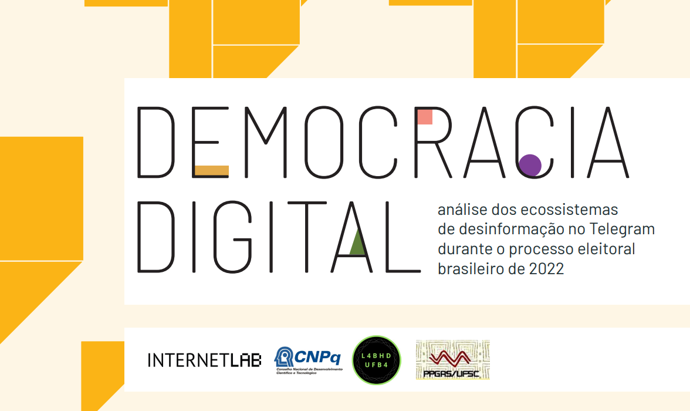

layout: true

```{r setup, include=FALSE}
options(htmltools.dir.version = FALSE)

knitr::opts_chunk$set(
	echo = FALSE,
	fig.align = "center",
	message = FALSE,
	warning = FALSE,
	cache = FALSE
)
```

```{r eval=FALSE, include=FALSE}
library(knitr)
library(tidyverse)
```

---
class: middle, center  

# Apresentações!😃 🙋️

---
class: middle, center  

# Leonardo F. Nascimento

```{r out.width="25%"}
knitr::include_graphics("img/logos_bia.png")
```

## 15% Programador, 20% Químico, 25% Psicólogo, 40% Cientista Social
<br>

### [Email: **leofn3@gmail.com**](mailto:leofn3@gmail.com) 

### [Twitter:**@leofn3**](http://www.twitter.com/leofn3) 

### [website: **www.leofn.com**](http://www.leofn.com)

---
class: middle, center  

```{r, out.width="50%"}
knitr::include_graphics("img/labhd.png")
```

## Laboratório de Humanidades Digitais da UFBA

**Twitter**: [@labhdufba](https://twitter.com/labhdufba) 
<br>
**Instagram**: [@labhdufba](http://instagram.com/labhdufba)
<br>
**Github**: [https://github.com/LABHDUFBA](https://github.com/LABHDUFBA)
<br>
**Youtube**: [https://www.youtube.com/c/LABHDUFBA](https://www.youtube.com/c/LABHDUFBA)

---
class: middle, center

# Pesquisa atual
--

```{r, out.width="100%"}

```

### + info [clique](https://internetlab.org.br/pt/noticias/analisando-os-ecossistemas-de-desinformacao-politica-no-telegram-durante-o-periodo-eleitoral/) 

---
class: middle, center

# Financiamento

.pull-left[
```{r, out.width="80%"}
knitr::include_graphics("img/cnpq.jpg")
```
]
.pull-right[
```{r, out.width="90%"}
knitr::include_graphics("img/internetlab.png")
```
]

---
class: inverse, center, middle

# Objetivo do encontro

---
class: inverse, center, middle

# Apresentar um breve panorama da Ciência Social Computacional (CSC) e sua relação com a Sociologia/Antropologia/História/Humanidades Digitais, enfatizando conceitos, ferramentas e desafios!

---
class: center, middle

# Duplo diagnóstico:
<br>

--
## 1) "Digitalização do eu na vida cotidiana";
<br>

--
## 2) Efeitos sobre a produção de conhecimento nas Humanidades.

---
class: inverse, middle, center

# 1) "Digitalização do eu na vida cotidiana" 

```{r, out.width="80%"}
knitr::include_graphics("img/ds.jpeg")
```
---
class: middle, center

# Algoritmização de processos sociais

```{r, out.width="60%"}
knitr::include_graphics("img/matrix-digital-self.png")
```

---
class: middle, center

# Traços digitais (digital data trace)

```{r, out.width="75%"}
knitr::include_graphics("img/socioloy.png")
```

---
class: middle, center

# Dataficação

```{r, out.width="75%"}
knitr::include_graphics("img/datafication4.jpg")
```

---
class: middle, center

# Cultura de vigilância

```{r, out.width="65%"}
knitr::include_graphics("img/surv.jpg")
```

---
class: inverse, middle, center

# 2) Efeitos sobre a produção de conhecimento nas Humanidades: 

---
class: middle, center

# [The Coming Crisis of Empirical Sociology](https://journals.sagepub.com/doi/abs/10.1177/0038038507080443)
--

<br>
## Artigo de 2007 mais citado da sociologia (1411 citações em 2023!) 
--

<br>
## Trata da mudança do significado da pesquisa empírica e nos repertórios metodológicos da sociologia
--

<br>
## Ideia central: "É a relevância das tecnologias de pesquisa empírica para a sociedade que torna a sociologia um campo de pesquisas importante socialmente"


---
class: middle, center

# Conclusões

## "The internet is configuring a new scholarly apparatus that engenders different modes of research, scholarship and communication" (Featherstone, 2009)


---
class: middle, center

## Obrigado gente!

.pull-left[
```{r, out.width="70%"}
knitr::include_graphics("https://media.giphy.com/media/JQRVMKkWAQbdiXFBkg/giphy.gif")
```
]
.pull-right[
##**Agradecimentos especiais**: 

- À Polyana Barboza, Lucas Roberto Silva, Amaro Grassi, Tiago Ventura pelo convite!

- Aos **bolsistas IC do projeto (Pibic, Pibiti e Permanecer):** Iolanda, Thamyres, Daniel, Talia, Emily, Beatriz, Priscila, Ingrid, Anna Carol, Malu, Juciane (mestranda) e Jefte (mestrando)!
<br>

### 
<br>

### Vida longa ao SICSS!
]


---
class: middle, center

## Referências bilbiográficas

#### [FEATHERSTONE, M. Ubiquitous Media: An Introduction. Theory, Culture & Society, v. 26, n. 2–3, p. 1–22, 1 mar. 2009.](https://journals.sagepub.com/doi/10.1177/0263276409103104)
